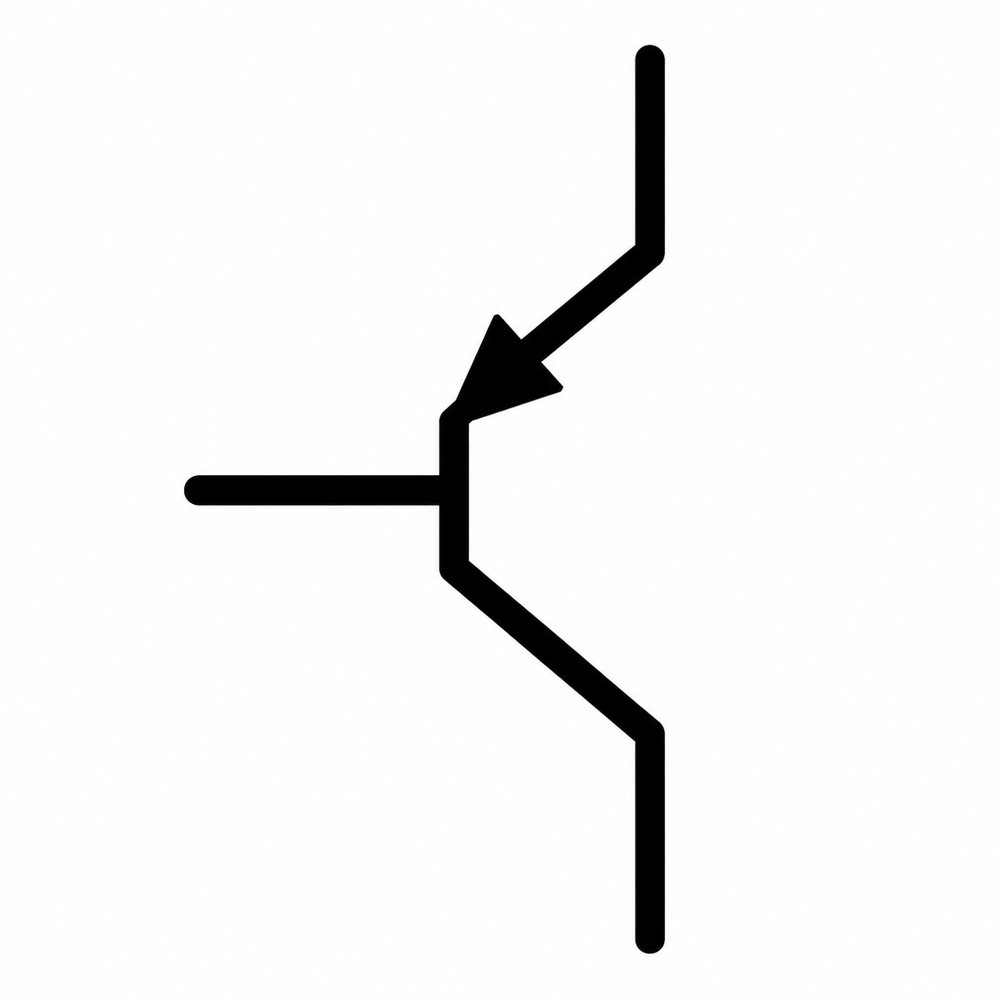

<div align="center">
  

  <h1>Paper2Poster</h1>

  <p>
    <a href="./README.en.md">English</a>
    |
    <a href="./README.md">简体中文</a>
  </p>

</div>


## 1️⃣ Poster Examples (2026.08.10)

<table>
  <tr>
    <td align="center">
      <br>
      <b>arXiv.2506.18028</b>
    </td>
    <td align="center">
      <br>
      <b>arXiv.2402.17228</b>
    </td>
    <td align="center">
      <br>
      <b>arXiv.2306.00978</b>
    </td>
    <td align="center">
      <br>
      <b>arXiv.2211.10438</b>
    </td>
  </tr>
</table>


## 2️⃣ Introduction

This is a Paper2Poster project that uses agents to convert academic papers into academic posters with minimal human intervention. The generated posters remain editable in LaTeX for further customization.

> [!NOTE]
>
> This project is under active long-term development. Please stay tuned ✒️✒️✒️...
>
> For questions or suggestions, please consult 5️⃣ FAQ first. For anything else, please open an Issue 🤗🤗🤗...

## 3️⃣ Environment

### Windows

- 📦 Python packages

	```Shell
	Set-Location D:\kao\PNP

	conda create -n PNP python=3.11 pip -y
	conda activate PNP
	python -m pip install -r .\requirements.txt
	```

- 💻 System dependencies

    Install the following tools and add them to the `System PATH`:

    - **TeX Live**
    - **pdftocairo**

- Usage examples

    - ```shell
        & "D:\Anaconda3\envs\Pytorch\python.exe" .\code\entry.py 2402.17228
        ```

    - ```shell
        & "D:\Anaconda3\envs\Pytorch\python.exe" .\code\entry.py 2402.17228 2508.10104 2312.00752
        ```
    > [!TIP]
    >
    > If the generated poster does not meet your expectations, you can freely edit the LaTeX files under `output/poster/<paper_id>/` for personalized post-processing.
    >
    > You can also inspect the relevant parameters in `entry.py`, edit intermediate results, and resume execution from any stage of the pipeline to iteratively improve the final poster 🤗🤗🤗.

## 4️⃣ File Tree

- Input files

  ```python
  PNP/
  ├── .gitignore
  ├── README.md
  ├── README.zh-CN.md
  ├── requirements.txt
  │
  ├── assets/
  │   └── logo.png                         # Project logo
  │
  └── code/
      ├── entry.py                         # Project entry point
      │
      ├── agent/
      │   ├── __init__.py
      │   ├── paper_classifier.py          # Classifies the paper's contribution type
      │   ├── paper_elements.py            # Re-extracts Section, Figure, Table, and Equation elements
      │   ├── parser_arxiv.py              # Converts Table/Equation LaTeX fragments and Figure PDFs into images
      │   ├── parser_vlm.py                # Performs VLM analysis of Figure, Table, and Equation elements
      │   ├── rag.py                       # Builds and queries the LightRAG database
      │   ├── response.py                  # Tolerantly parses JSON returned by the LLM
      │   ├── summary.py                   # Summarizes textual content and visual resources
      │   ├── poster_layout.py             # Calculates poster Panel grouping, two-column layout, and resource sizes
      │   ├── poster_latex.py              # Renders LaTeX templates and compiles posters
      │   └── poster_review.py             # Performs VLM review of poster columns and the final poster
      │
      ├── config/
      │   └── poster_layout.yaml           # Poster size, font, spacing, and layout parameters (tune as needed)
      │
      ├── prompt/
      │   ├── zh_en.json                   # Hash records for Chinese Prompt files and automated Chinese-English translation
      │   │
      │   ├── zh/
      │   │   ├── paper_classifier.yaml        # Determines the paper's contribution type
      │   │   ├── paper_type_guidance.yaml     # Type-specific guidance for summarizing paper content
      │   │   ├── equation_analyzer.yaml       # Formula VLM analysis
      │   │   ├── figure_analyzer.yaml         # Figure VLM analysis (optional)
      │   │   ├── table_analyzer.yaml          # Table VLM analysis (optional)
      │   │   ├── rag_queries.yaml             # RAG queries
      │   │   ├── rag_type_queries.yaml        # Type-specific supplementary RAG queries
      │   │   ├── rag_asset_analyzer.yaml      # Selects valuable Figure, Table, and Equation elements
      │   │   ├── summary.yaml                 # Organizes content after RAG queries
      │   │   ├── summary_type_guidance.yaml   # Type-specific guidance for post-RAG content organization
      │   │   ├── poster_column_review.yaml    # VLM review of the left and right poster columns
      │   │   └── poster_final_review.yaml     # VLM review of the final poster
      │   │
      │   └── en/                              # English translations of the corresponding Prompts in zh/
      │       ├── paper_classifier.yaml
      │       ├── paper_type_guidance.yaml
      │       ├── equation_analyzer.yaml
      │       ├── figure_analyzer.yaml
      │       ├── table_analyzer.yaml
      │       ├── rag_queries.yaml
      │       ├── rag_type_queries.yaml
      │       ├── rag_asset_analyzer.yaml
      │       ├── summary.yaml
      │       ├── summary_type_guidance.yaml
      │       ├── poster_column_review.yaml
      │       └── poster_final_review.yaml
      │
      ├── template/
      │   └── latex/
      │       ├── preamble.tex              # Theme colors, fonts, and Panel styles
      │       ├── panel.tex.j2              # Individual Panel template
      │       ├── column_preview.tex.j2     # Single-column preview template
      │       └── poster.tex.j2             # Final poster template
      │
      ├── utils/
      │   ├── load_env.py                   # Loads environment variables
      │   ├── retry.py                      # Exponential-backoff API retries
      │   └── transport_en.py               # Translates Chinese Prompts according to hash records
      │
      └── arxiv2agent/                      # See [README Reference] for details
          ├── __init__.py
          ├── NOTICE.md
          ├── arxiv_api.py                  # Downloads arXiv source files
          ├── core.py                       # Main paper-source parsing pipeline
          ├── extract.py                    # Extracts content and resources
          ├── _tex.py                       # Parses and cleans TeX
          ├── bib.py                        # Processes references
          ├── denoise.py                    # Denoises text
          ├── markers.py                    # Processes structural markers
          ├── schema.py                     # Defines the paper structure
          └── writer.py                     # Writes paper.json and extracted resources
  ```

- Output files

  ```python
  output/
  ├── arxiv/                                # See [README Reference] for details
  │   └── <paper_id>/
  │       ├── paper.json
  │       ├── source/
  │       ├── figures/
  │       ├── tables/
  │       └── equations/
  │
  ├── temp/
  │   └── <paper_id>/                       # Multiple arXiv IDs produce multiple directories
  │       ├── sections.json                 # Extracted textual information
  │       ├── figures.json                  # Extracted figure information
  │       ├── tables.json                   # Extracted table information
  │       ├── equations.json                # Extracted equation information
  │       ├── paper_profile.json            # Paper-type classification
  │       ├── content_list.json             # Structured paper information supplied to RAG
  │       ├── raw_query_results.json        # RAG query results
  │       ├── summary_input.md              # RAG query results in Markdown for secondary LLM summarization
  │       ├── poster_evidence.json          # Preselected poster content
  │       ├── rag_sections/                 # Human-readable organized section content supplied to RAG
  │       ├── rag_storage/                  # Files generated by the LightRAG database
  │       └── poster/
  │           ├── poster_layout.json        # Layout parameters
  │           ├── previews/
  │           │   ├── left.png              # Left-column preview
  │           │   └── right.png             # Right-column preview
  │           └── latex/
  │               ├── preamble.tex          # LaTeX preamble template
  │               ├── panels/               # LaTeX details for individual poster Panels
  │               ├── columns/              # LaTeX details for poster columns
  │               └── measurements/         # Poster-layout measurements
  │
  └── poster/
      └── <paper_id>/
          ├── poster.tex                    # Editable final poster LaTeX
          ├── poster.pdf                    # Final poster PDF
          ├── poster.png                    # Final poster PNG
          ├── preamble.tex                  # Poster preamble
          ├── panels/                       # LaTeX for poster Panels
          └── columns/                      # LaTeX for left and right poster columns
  ```

## 5️⃣ FAQ

- API configuration

  - Project APIs can be configured freely in `.env`.
  - Due to budget constraints and model performance, the examples in this README were mainly produced with `gpt-4o-mini`, `text-embedding-3-small`, and `gpt-image-2`. Because of current implementation details, non-OpenAI models are not yet supported.
  - ✒️ TODO: Add compatibility with APIs from other providers.
- Poster quality optimization

  - Users can freely revise and compile the generated LaTeX poster to meet personalized requirements.
  - The project currently does not support landscape posters or canvas-size adjustment.
  - 💡 Regarding poster layout, existing projects that support customizable canvas sizes generally follow one of two approaches. Some, such as Paper2Poster, fit real poster layouts with a linear model and then refine them with a VLM. Others, such as Paper2Slides, pass the canvas size directly to an image-generation model. The former produces high-resolution posters because it does not rely on direct AI image generation, but its format is relatively rigid. The latter offers flexible and visually appealing layouts, but poster resolution is constrained by the image-generation model. To improve layout while keeping costs manageable, I believe rule-based approaches such as intelligent optimization or reinforcement learning may be appropriate because poster design involves many fuzzy constraints, including canvas size, text length, image size, and spacing. I am not proficient in reinforcement learning or intelligent algorithms and therefore cannot explore this direction deeply. My judgment may be incorrect, but while working on this project I encountered the Kaggle competition [Santa 2025 - Christmas Tree Packing Challenge](https://www.kaggle.com/competitions/santa-2025), which might offer inspiration for poster-layout algorithms.
  - 💡 For poster-content optimization, modifying the relevant Prompts is recommended over upgrading the model configuration.
  - ✒️ TODO: Improve the Prompts to increase poster-content quality.
  - ✒️ TODO: Develop a better free-layout algorithm to improve control over the canvas.
- API costs

  - Without VLM-assisted analysis of table images, token costs are relatively low. Actual consumption depends on paper length and the number of figures. Under the default configuration (`gpt-4o-mini`, `text-embedding-3-small`, and `gpt-image-2`), processing one paper generally costs RMB 1–2 per run.
- Known project bugs
  - ✒️ TODO: The VLM iterative negative-feedback process has issues; the multi-agent collaboration component needs improvement.
  - ✒️ TODO: The current two-column layout can be unbalanced and depends on the layout algorithm and VLM self-feedback.
  - ✒️ TODO: Resolve inconsistent image sizes in generated posters.
  - 💡 Why do images in generated posters have inconsistent sizes? Projects such as Paper2Poster and Paper2Slides process paper PDFs using tools such as MinerU and Docling. Since all images are extracted from the original PDF, their relative sizes are known and generally correspond to reasonable information density and area. PNP instead reads image resources directly from the extracted arXiv TeX source. It cannot determine, at low cost, the scaling applied to each image in the original LaTeX document, which causes inconsistent image proportions in the final poster. The same problem affects rendered tables and equations. Why not insert tables and equations directly as LaTeX? Conference papers use widely varying LaTeX templates, and their table and equation fragments often depend on custom macros. Direct insertion therefore frequently causes compilation errors, while improving compatibility is itself a substantial engineering task.
  - ✒️ TODO: Add a project benchmark.
  - ✒️ TODO: Add conference badges, institutional logos, and related visual elements to generated posters.

- For any other questions, please open an Issue 🤗🤗🤗.


## 6️⃣ References
- ☀️ Paper2Poster
  - 🌟 Tool
    - [Arxiv 2 Agent](https://github.com/wuyoscar/arxiv2agent.git). More details are available on [RedNote](http://xhslink.cn/o/7ywdm5s2Pbp).
  - 🌟 Agent
    - [Paper2Slides](https://github.com/HKUDS/Paper2Slides)
    - [Paper2Poster](https://github.com/paper2poster/paper2poster), NeurIPS 2025 Poster
    - [PosterGen](https://github.com/Y-Research-SBU/PosterGen), CVPR 2026 Findings
    - [PaperX](https://github.com/yutao1024/PaperX)
  - 🌟 Skill
    - [Skill2Poster](https://github.com/LEON-gittech/Skill2Poster)
- ☀️ Other interesting projects
  - [Word Agent](https://github.com/visresearch/WordAgent)
